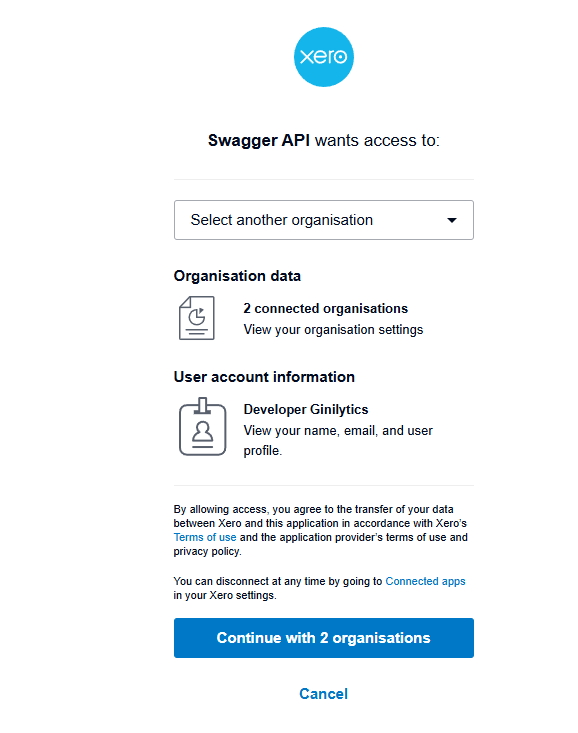

1. Types of Xero APIs
Xero provides several API categories. The most commonly used one is the Accounting API, but here’s a list of key APIs:

# API Category	                Description
# Accounting API	            Access to invoices, bills, contacts, payments, accounts, etc.
# Projects API	                Manage time and tasks for project tracking.
# Payroll API	                (For AU, UK, NZ) – Access payroll data and employees.
# Assets API	                Manage fixed assets and depreciation.
# Files API	                    Upload, download and attach files to records.
# Bank Feeds API	            Connect and push bank transaction data.
# Practice Manager API	        For accountants to manage clients, jobs, tasks, etc.
# OAuth2 Identity API	        To get user identity and connection info.

# Sample headers for any Xero API:

🔹 Step 1: Redirect User to Xero Authorization URL
Let user log in and approve access.It should look like this

Approve it it will give you token

🔹 Step 2: 
 Ensure You're Using the Access Token (not ID token or refresh token) to call API

You get this response:

{
  "access_token": "...",       ✅ use in Authorization header
  "id_token": "...",           ❌ only for login identity
  "refresh_token": "...",      ✅ use to get new access tokens
  "expires_in": 1800
}

step 3 Call API
